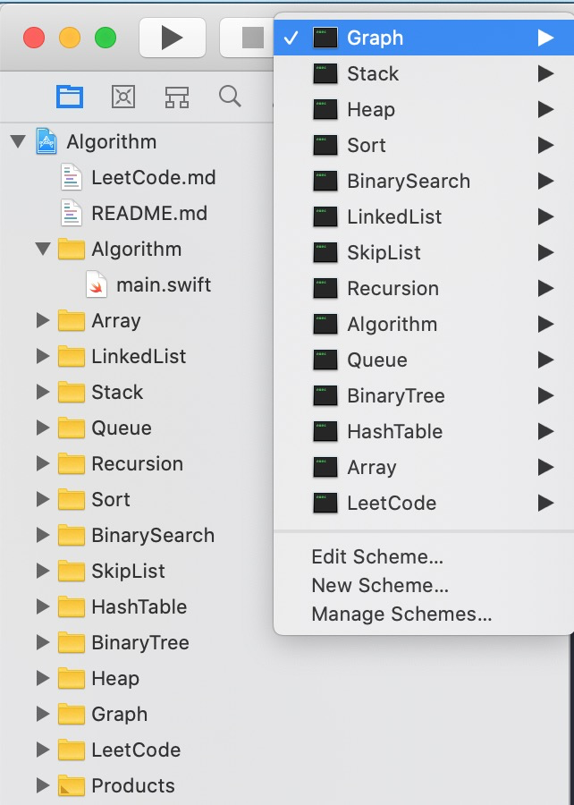

# algorithm
#### 使用 Swift 语言实现数据结构与算法之美专栏代码 ，在原有基础上扩增了一些内容，原始代码 https://github.com/wangzheng0822/algo

## 一、目录结构
#### 源代码在第一级目录所对应的文件夹下，测试工程以及测试代码在 [Algorithm](./Algorithm) 目录下，可以直接使用 Xcode 打开工程文件 `Algorithm.xcodeproj`，选择对应的 Target 运行测试代码

## 二、数据结构内容

### 数组
- [实现一个支持动态扩容的数组](./Array/Set.swift)
- [实现一个大小固定的有序数组，支持动态增删改操作](./Array/Array.swift)
- [实现两个有序数组合并为一个有序数组](./Array/MergeTwoSortedArray.swift)

### 链表
- 实现[单链表](./LinkedList/SinglyLinkedList.swift)、[循环链表](./LinkedList/LoopLinkedList.swift)、[双向链表](./LinkedList/DoublyLinkedList.swift)，支持增删操作
- [实现单链表反转](./LinkedList/SinglyLinkedList.swift)
- [实现两个有序的链表合并为一个有序链表](./LinkedList/LinkedListFunc.swift)
- [实现求链表的中间结点](./LinkedList/SinglyLinkedList.swift)
- [实现求链表的倒数第K个结点（快慢指针）](./LinkedList/SinglyLinkedList.swift)
- [判断链表是否有环](./LinkedList/LinkedListFunc.swift)
- [链表有环的话，求链表环的入口位置](./LinkedList/LinkedListFunc.swift)

### 栈
- [用数组实现一个顺序栈](./Stack/ArrayStack.swift)
- [用链表实现一个链式栈](./Stack/LinkedListStack.swift)
- [编程模拟实现一个浏览器的前进、后退功能](./Stack/Browser.swift)

### 队列
- [用数组实现一个顺序队列](./Queue/ArrayQueue.swift)
- [用链表实现一个链式队列](./Queue/LinkedListQueue.swift)
- [实现一个循环队列](./Queue/LoopQueue.swift)

### 递归
- [编程实现斐波那契数列求值 f(n) = f(n-1) + f(n-2)](./Recursion/RecursionFunc.swift)
- [编程实现求阶乘 n!](./Recursion/RecursionFunc.swift)
- [编程实现一组数据集合的全排列](./Recursion/RecursionFunc.swift)
- [台阶总共多少走法问题](./Recursion/RecursionFunc.swift)
- [递归常见问题](./Recursion/RecursionFunc.swift)

### 排序算法
- [冒泡排序、插入排序、希尔排序、选择排序](./Sort/BubbleInsertionSelectionFunc.swift)
- [归并排序](./Sort/MergeSortFunc.swift)、[快速排序](./Sort/QuickSort.swift)
- [桶排序、计数排序、基数排序（未实现）](./Sort/LinearSort.swift)
- [编程实现O(n)时间复杂度内找到一组数据的第K大元素](./Sort/SortFunc.swift)

### 二分查找
- [实现一个有序数组的二分查找算法](./BinarySearch/BinarySearch.swift)
- [实现一个数的平方根求解，要求精确到小数点后六位](./BinarySearch/SqrtFunc.swift)
- [实现模糊二分查找算法（比如大于等于给定值的第一个元素）](./BinarySearch/VagueBinarySearch.swift)
- [实现循环有序数组查找给定值](./BinarySearch/LoopSortArrayFunc.swift)

### 跳表
- [实现跳表](./SkipList/SkipList.swift)

### 散列表
 - [实现一个基于链表法解决冲突问题的散列表](./HashTable/HashTable.swift)
 - [实现一个LRU缓存淘汰算法](./HashTable/LRUBaseHashTable.swift)
 
 ### 二叉树
 - [实现一个二叉查找树，并且支持插入、删除、查找操作](./BinaryTree/BinarySearchTree.swift)
 - [实现查找二叉查找树中某个结点的后继、前驱结点](./BinaryTree/BinarySearchTree.swift)
 - [实现二叉树的前、中、后序以及按层遍历](./BinaryTree/BinaryTree.swift)
 
 ### 堆
 - [实现一个小顶堆、大顶堆、优先级队列](./Heap/Heap.swift)
 - [实现堆排序](./Heap/HeapSort.swift)
 - [利用优先级队列合并K个有序数组](./Heap/MergeKSortedArray.swift)
 - [求一组动态数据集合的最大Top K](./Heap/Heap.swift)
 
 ### 图
 - 实现有向图、无向图、有权图、无权图的[邻接矩阵](./Graph/MatrixGraph.swift)和[邻接表](./Graph/ListGraph.swift)表示方法
 - 实现图的[深度优先搜索](./Graph/MatrixGraph.swift)、[广度优先搜索](./Graph/ListGraph.swift)
 - 实现图的[最小生成树](./Graph/ListGraph.swift)算法（Kruskal、Prime）
 - 实现 [Dijkstra](./Graph/ListGraph.swift) 算法、A*算法
 - 实现拓扑排序的 [Kahn 算法](./Graph/TopologicalSort.swift)、[DFS 算法](./Graph/TopologicalSort.swift)
 
 ### 字符串
  - 实现[朴素的字符串匹配算法](./String/BFRKSearch.swift)
  - 实现[BM算法](./String/BMSearch.swift)
  - 实现[KMP算法](./String/KMPSearch.swift)
 - 实现一个字符集，只包含a~z这26个英文字母的[Trie树](./String/Trie.swift)
 
 ### 贪心算法
 - 分糖果、钱币找零、区间覆盖
 - 霍夫曼编码问题
 - [非负整数中，移除K个数字，让剩下的数字值最小](./Greedy/Greedy.swift)
 - n个人等待服务问题，如何安排被服务的先后顺序，使 n 个人总的等待时间最短
 
 ### 分治算法
 - [求一组数据的逆序对个数](./DivideAndConquer/DivideAndConquer.swift)
 
 ### 回溯算法
 - [利用回溯算法求解八皇后问题](./Backtrack/Queens.swift)
 - [利用回溯算法求解0-1背包问题](./Backtrack/Package.swift)
 
 ### 动态规划
 - [0-1背包问题](./DynamicProgramming/PackageDP.swift)
 - [最小路径和](./DynamicProgramming/Chessboard.swift)
 - 编程实现莱文斯坦最短编辑距离
 - 编程实现查找两个字符串的最长公共子序列
 - 编程实现一个数据序列的最长递增子序列
 
 ## 未完待续...
